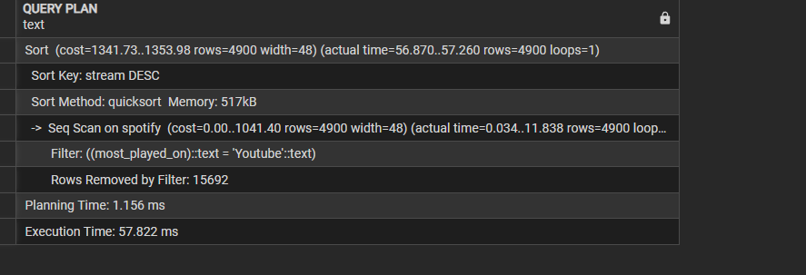

# Spotify Advanced SQL Project and Query Optimization 

[Click Here to get Dataset](https://www.kaggle.com/datasets/sanjanchaudhari/spotify-dataset)


## Overview
This project involves analyzing a Spotify dataset with various attributes about tracks, albums, and artists using **SQL**. It covers an end-to-end process of normalizing a denormalized dataset, performing SQL queries of varying complexity (easy, medium, and advanced), and optimizing query performance. The primary goals of the project are to practice advanced SQL skills and generate valuable insights from the dataset.

```sql

-- Spotify Project


-- create table
CREATE TABLE spotify (
    artist VARCHAR(255),
    track VARCHAR(255),
    album VARCHAR(255),
    album_type VARCHAR(50),
    danceability FLOAT,
    energy FLOAT,
    loudness FLOAT,
    speechiness FLOAT,
    acousticness FLOAT,
    instrumentalness FLOAT,
    liveness FLOAT,
    valence FLOAT,
    tempo FLOAT,
    duration_min FLOAT,
    title VARCHAR(255),
    channel VARCHAR(255),
    views FLOAT,
    likes BIGINT,
    comments BIGINT,
    licensed BOOLEAN,
    official_video BOOLEAN,
    stream BIGINT,
    energy_liveness FLOAT,
    most_played_on VARCHAR(50)
);

select * from spotify
```
### Exploratory Data Analysis(EDA)
1. Count the number of tracks
   ```sql
   select  count(*) from  spotify
   ```
2. Count the unique artist
   ```sql
	select count(distinct artist) from spotify
   ```

3. Unique albm_type in our dataset
   ```sql
	select distinct album_type from spotify

   ```

4. Minmum and Maxmum duration of tracks
   ```sql
	select max(duration_min) from spotify
	select min(duration_min) from spotify
   ```
5. Unique Channel in our dataset
   ```sql
	select distinct channel from spotify

   ```

6. Most tracks played in which platform
   ```sql
	select distinct most_played_on from spotify
   ```
## Project Steps

### 1. Data Exploration
Before diving into SQL, it’s important to understand the dataset thoroughly. The dataset contains attributes such as:
- `Artist`: The performer of the track.
- `Track`: The name of the song.
- `Album`: The album to which the track belongs.
- `Album_type`: The type of album (e.g., single or album).
- Various metrics such as `danceability`, `energy`, `loudness`, `tempo`, and more.

### 4. Querying the Data
After the data is inserted, various SQL queries can be written to explore and analyze the data. Queries are categorized into **easy**, **medium**, and **advanced** levels to help progressively develop SQL proficiency.

#### Easy Queries
- Simple data retrieval, filtering, and basic aggregations.
  
#### Medium Queries
- More complex queries involving grouping, aggregation functions, and joins.
  
#### Advanced Queries
- Nested subqueries, window functions, CTEs, and performance optimization.

### 5. Query Optimization
In advanced stages, the focus shifts to improving query performance. Some optimization strategies include:
- **Indexing**: Adding indexes on frequently queried columns.
- **Query Execution Plan**: Using `EXPLAIN ANALYZE` to review and refine query performance.
  
---

## 15 Practice Questions

### Easy Level
1. Retrieve the names of all tracks that have more than 1 billion streams.
 ```sql
	select * from spotify
	where stream > 1000000000
```
2. List all albums along with their respective artists.
```sql
	select 
	distinct album,
	artist
	from spotify
	order by 1

```
3. Get the total number of comments for tracks where `licensed = TRUE`.
```sql
	select  
	sum(comments) as total_comments
	from spotify
	where licensed = 'true'

```
4. Find all tracks that belong to the album type `single`.
```sql
	select * from spotify
	where album_type = 'single'
```
5. Count the total number of tracks by each artist.
```sql
	select 
	artist,
	count(*) as total_no_tracks
	from spotify
	group by 1
	order by 2 desc
```

### Medium Level
1. Calculate the average danceability of tracks in each album.
```sql
	select 
	album,
	avg(danceability) as avg_danceability
	from spotify 
	group by 1
	order by 2 desc

```
2. Find the top 5 tracks with the highest energy values.
```sql
	select 
	track,
	avg(energy) as avg_energy
	
	from spotify
	group by 1
	order by 2 desc
```
3. List all tracks along with their views and likes where `official_video = TRUE`.
```sql
	select 
	track,
	sum(views) as total_views,
	sum(likes) as total_likes
	
	from spotify
	where official_video = 'true'
	GROUP by 1
	order by 2 desc
	limit 5
```

4. For each album, calculate the total views of all associated tracks.
```sql
	select 
	album,
	track,
	sum(views)
	from spotify
	group by 1,2
	order by 3 desc
```

5. Retrieve the track names that have been streamed on Spotify more than YouTube.
```sql
	select * from
(
select 
	track,
	-- most_played_on,
	COALESCE(sum(case when most_played_on = 'Youtube' then stream end),0) as stremed_on_youtube,
	coalesce(sum(case when most_played_on = 'Spotify' then stream end),0) as stremed_on_spotify
from spotify
group by 1
) as t1
where 
	stremed_on_spotify > stremed_on_youtube
	and
	stremed_on_youtube != 0

```

### Advanced Level
1. Find the top 3 most-viewed tracks for each artist using window functions.
```sql
with  ranking_artist as
(
select 
	artist,
	track,
	sum(views) as total_views,
	dense_rank() over(partition by artist order by sum(views)  desc) as rank
from spotify
group by 1 , 2
order by 1 , 3 desc
) 

select * from ranking_artist
where rank <= 3

```
2. Write a query to find tracks where the liveness score is above the average.
```sql
select * from spotify
where  liveness > (select 
		   avg(liveness)
                    from spotify)

```

3. **Use a `WITH` clause to calculate the difference between the highest and lowest energy values for tracks in each album.**
```sql
with cte as
(
select 
	album,
	max(energy) as highest_energy,
	min(energy) as lowest_energy
from spotify
group by 1
)
select 
	album,
	highest_energy - lowest_energy as energy_avg
	
from cte
order by 2 desc

```
   
5. Find tracks where the energy-to-liveness ratio is greater than 1.2.
```sql
	select track ,energy_liveness  from spotify
	where energy_liveness > 1.2

```

6. Calculate the cumulative sum of likes for tracks ordered by the number of views, using window functions.
```sql
	select 
	track,
	views,
	likes,
	sum(likes) over(order by views desc) as cumulative_likes
	from spotify


```


Here’s an updated section for your **Spotify Advanced SQL Project and Query Optimization** README, focusing on the query optimization task you performed. You can include the specific screenshots and graphs as described.

---

## Query Optimization Technique 

To improve query performance, we carried out the following optimization process:

- **Initial Query Performance Analysis Using `EXPLAIN`**
    - We began by analyzing the performance of a query using the `EXPLAIN` function.
    - The query retrieved tracks based on the `artist` column, and the performance metrics were as follows:
        - Execution time (E.T.): **7 ms**
        - Planning time (P.T.): **0.17 ms**
    - Below is the **screenshot** of the `EXPLAIN` result before optimization:
      

- **Index Creation on the `artist` Column**
    - To optimize the query performance, we created an index on the `artist` column. This ensures faster retrieval of rows where the artist is queried.
    - **SQL command** for creating the index:
      ```sql
      CREATE INDEX idx_artist ON spotify_tracks(artist);
      ```

- **Performance Analysis After Index Creation**
    - After creating the index, we ran the same query again and observed significant improvements in performance:
        - Execution time (E.T.): **0.153 ms**
        - Planning time (P.T.): **0.152 ms**
    - Below is the **screenshot** of the `EXPLAIN` result after index creation:
      

- **Graphical Performance Comparison**
    - A graph illustrating the comparison between the initial query execution time and the optimized query execution time after index creation.
    - **Graph view** shows the significant drop in both execution and planning times:
      
      
      

This optimization shows how indexing can drastically reduce query time, improving the overall performance of our database operations in the Spotify project.
---

